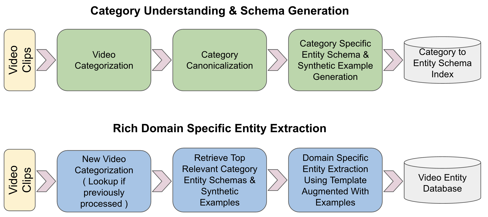

# RAVEN: An Agentic Framework for Multimodal Entity Discovery from Large-Scale Video Collections

We present RAVEN (**R**ecognition and **A**daptation of **V**ideo **EN**tities), an adaptive AI agent framework designed for multimodal entity discovery and retrieval in large-scale video collections. Synthesizing information across visual, audio, and textual modalities, RAVEN autonomously processes video data to produce structured, actionable representations for downstream tasks. Key contributions include (1) a category understanding step to infer video themes and general-purpose entities, (2) a schema generation mechanism that dynamically defines domain-specific entities and attributes, and (3) a rich entity extraction process that leverages semantic retrieval and schema-guided prompting. RAVEN is designed to be model-agnostic, allowing the integration of different vision-language models (VLMs) and large language models (LLMs) based on application-specific requirements. This flexibility supports diverse applications in personalized search, content discovery, and scalable information retrieval, enabling practical applications across vast datasets.

[Kevin Dela Rosa](https://perhaps.ai/) [](https://twitter.com/kdrwins) [](https://www.linkedin.com/in/kdrosa/) [](https://github.com/kdr) [](https://scholar.google.com/citations?user=8Pc5MiUAAAAJ&hl=en)

Presented at AI Agent for Information Retrieval [Agent4IR](https://sites.google.com/view/ai4ir/aaai-2025) @ [AAAI 2025](https://aaai.org/conference/aaai/aaai-25/)

[Presentation Slides](https://docs.google.com/presentation/d/11d8NsO3g9PiwS4DrpcbeInJGh-nsnRjXK-GKA6lEjb4/edit#slide=id.g332712572d6_0_1147)

## Highlights

### Multimodal Entity Discovery Framework

RAVEN processes videos by synthesizing information across visual, audio, and textual modalities to produce structured, actionable representations for downstream tasks.



### Domain Adaptability

The framework autonomously identifies video categories, normalizes them into canonical representations, and generates domain-specific entity schemas - all without manual intervention.

### Rich Entity Extraction

RAVEN extracts both generic entities (Person, Object, Location) and domain-specific entities (e.g., Historical Figures, Tools & Materials, Destinations) with their associated attributes.

### Model Agnostic Design

Designed to work with different vision-language models (VLMs) and large language models (LLMs) based on application-specific requirements, making it adaptable for various deployment scenarios.

## Framework Components

### 1. Category Understanding & Schema Generation

- **Video Categorization**: Process video clips to infer themes and categories
- **Category Canonicalization**: Normalize raw category concepts into a standardized format
- **Schema Generation**: Dynamically create entity schemas appropriate for each domain

### 2. Rich Domain-Specific Entity Extraction

- **Context-Aware Processing**: Apply appropriate schemas based on video content
- **Schema-Guided Prompting**: Use synthetic examples to guide structured extraction
- **Comprehensive Entity Attributes**: Extract not just entities but their relationships and attributes


## Citation

```bibtex
@inproceedings{delaRosa2025raven,
  title={RAVEN: An Agentic Framework for Multimodal Entity Discovery from Large-Scale Video Collections},
  author={Dela Rosa, Kevin},
  booktitle={AAAI Workshop on AI Agents for Information Retrieval (Agent4IR at AAAI 2025)},
  year={2025}
}
```

## Citation

```bibtex
@inproceedings{delaRosa2025raven,
  title={RAVEN: An Agentic Framework for Multimodal Entity Discovery from Large-Scale Video Collections},
  author={Dela Rosa, Kevin},
  booktitle={AAAI Workshop on AI Agents for Information Retrieval (Agent4IR at AAAI 2025)},
  year={2025}
}
```
